# Project Walkthrough

This document walks through the execution of the Netflix Data Engineering pipeline using Azure Data Factory, Databricks, Delta Lake, and Unity Catalog, with screenshots and explanations.

----------

## 1. Introduction

This project simulates a real-world, production-grade data engineering pipeline for ingesting and processing Netflix content metadata using the Medallion Architecture:

-   Bronze: Raw data ingestion (incremental)
    
-   Silver: Data cleaning and transformation
    
-   Gold: Aggregated, business-ready data (Delta Live Tables)
    

**Tools Used**:

-   Azure Data Factory (ADF)
    
-   Azure Data Lake Storage Gen2 (ADLS)
    
-   Databricks (Autoloader, Spark SQL, DLT)
    
-   Unity Catalog
    
-   Power BI (optional)

**Pipeline Architecture**:
    
                           +------------------+
                           |   GitHub (CSV)   |
                           +--------+---------+
                                    |
                                    v
                        +--------------------------+
                        |  Azure Data Factory (ADF)|
                        |  (HTTP Connector + Datasets) |
                        +--------------------------+
                                    |
                                    v
                 +-----------------------------------------+
                 |   Azure Data Lake Storage Gen2 - Raw    |
                 |           (Bronze Layer)                |
                 +-----------------------------------------+
                                    |
                                    v
               +--------------------------------------------+
               |     Databricks Autoloader (Incremental)    |
               +--------------------------------------------+
                                    |
                                    v
                +-------------------------------------------+
                | Azure Data Lake Storage Gen2 - Cleaned    |
                |           (Silver Layer)                  |
                |   (Transformations using Spark SQL)       |
                +-------------------------------------------+
                                    |
                                    v
                +-------------------------------------------+
                | Azure Data Lake Storage Gen2 - Serving    |
                |           (Gold Layer)                    |
                | (Delta Live Tables + STAR SCHEMA)         |
                +-------------------------------------------+
                        |                         |
                        v                         v
           +------------------------+   +-----------------------+
           | Azure Synapse (Optional)|   | Power BI (Reporting) |
           +------------------------+   +-----------------------+

----------

## 2. Data Source Setup

-   The source consists of 5 CSV files hosted on GitHub.
    
-   The main file `netflix_titles.csv` is manually uploaded into the **Raw** container of ADLS Gen2.
    
-   The remaining 4 lookup files are loaded via Azure Data Factory into the **Bronze Layer**.
    
-   ADF pipeline includes a validation check that ensures the pipeline only executes if `netflix_titles.csv` exists in the Raw layer.
    

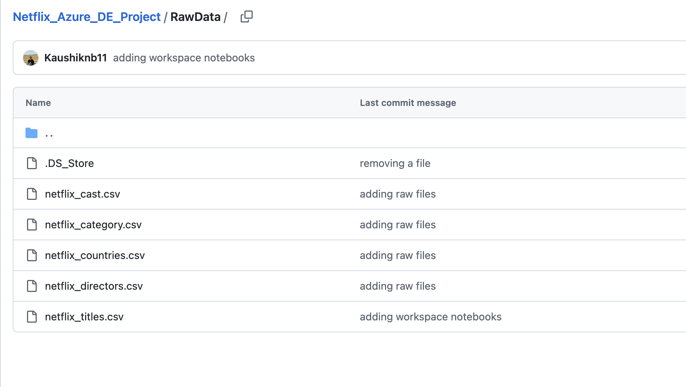
---
---
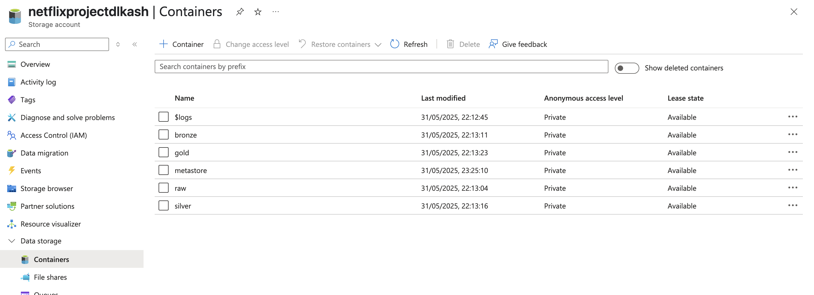
---
---
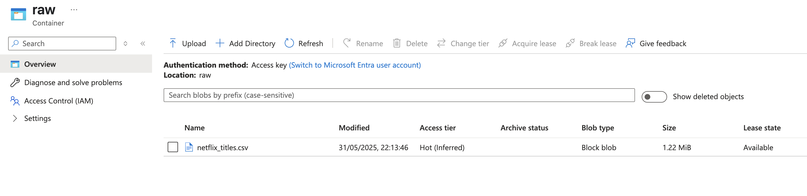

----------

## 3. Azure Data Factory Pipeline - Bronze Layer

-   ADF pipeline is configured with HTTP connector and dynamic datasets.
    
-   ForEach loop runs over the 4 lookup files for ingestion into Bronze.
    
-   Pre-check validates presence of master file before pipeline executes.
    

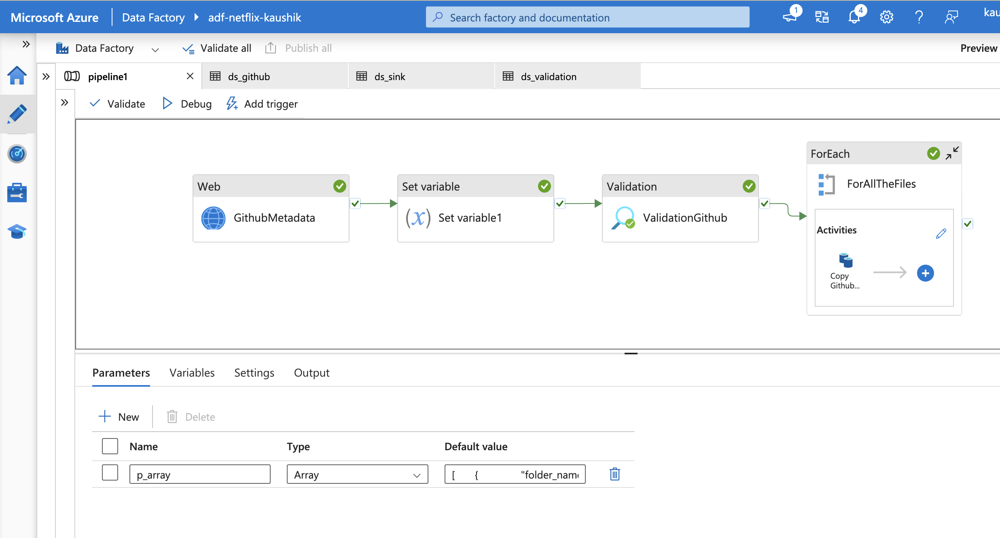
---
---
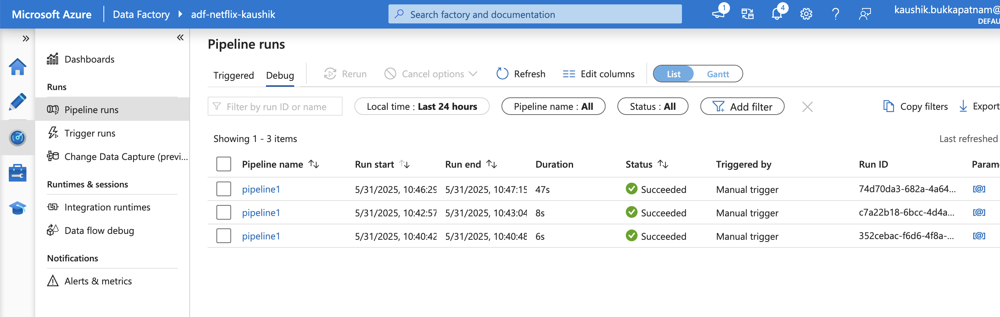
---
---
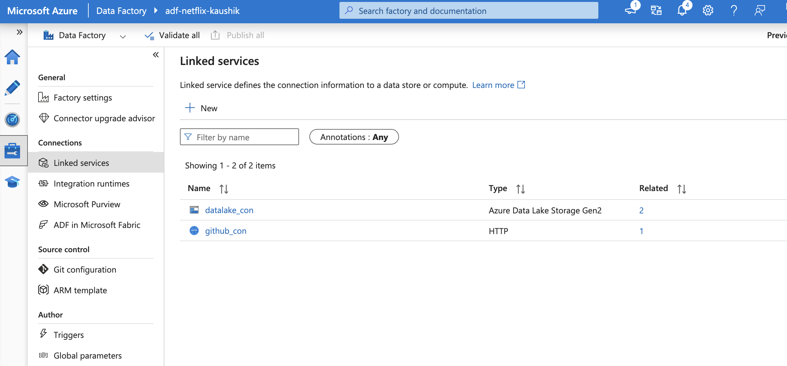
---
---
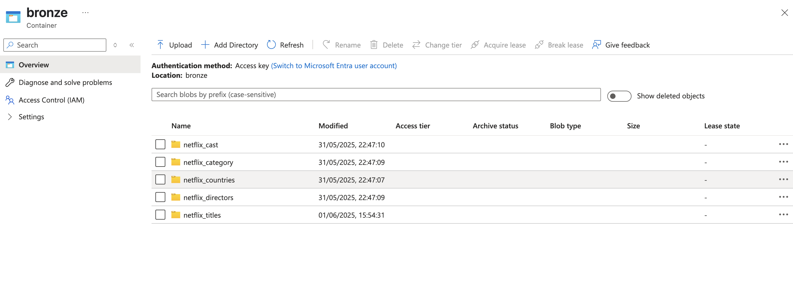

----------

## 4. Notebook `1_Autoloader`

-   This notebook is used to **register schema**, configure **checkpoint location**, and prepare the Bronze layer structure.
    
-   It does not handle ingestion from GitHub, but rather defines metadata and autoload configurations.
    
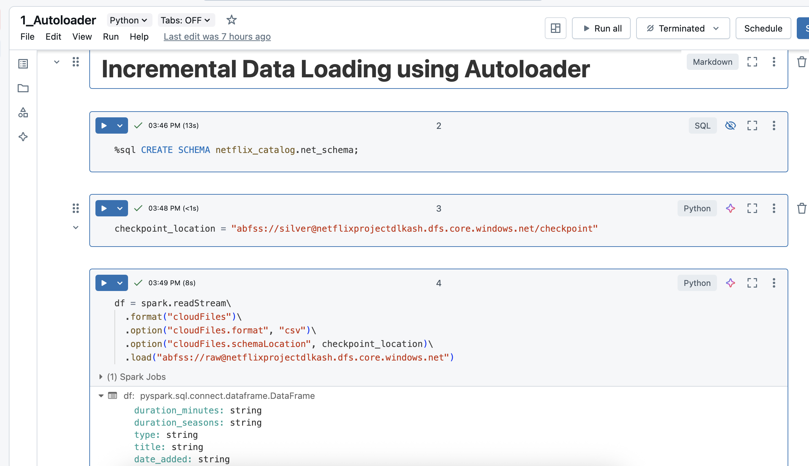
---
---
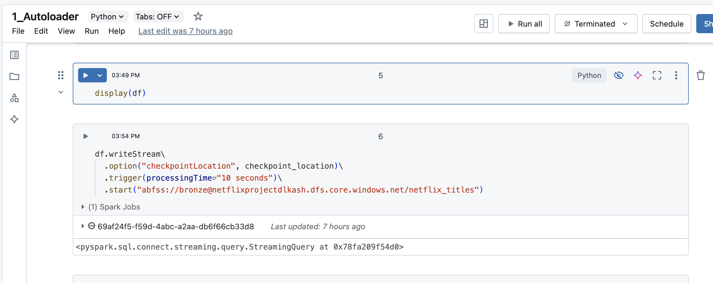

----------

## 5. Silver Layer — Notebooks `2_silver`, `3_lookupNotebook`, `4_Silver`, `5_lookupNotebook`, `6_WeekdayLookupOutput`

-   Data cleaning and transformations with Spark SQL
    
-   Joins with lookup tables for cast, country, category, directors
    
-   Enrichment with derived columns like weekday, length, etc.
    

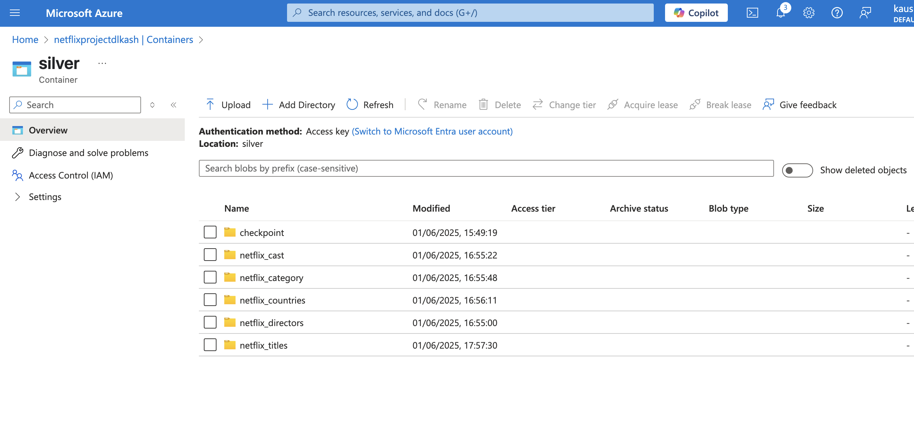

----------

## 6. Gold Layer — Notebook `7_DLT_Notebook`

-   Delta Live Tables pipeline setup
    
-   Creation of STAR schema tables: fact_titles, dim_cast, dim_country, etc.
    
-   Table quality and audit enforcement enabled
    
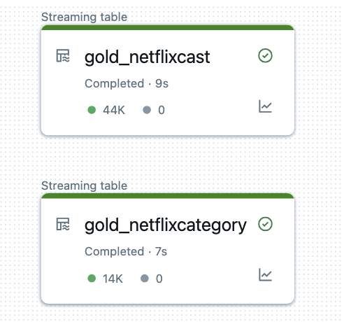
---
---
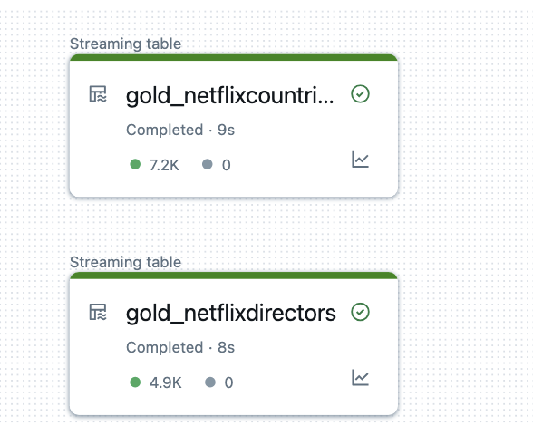
---
---
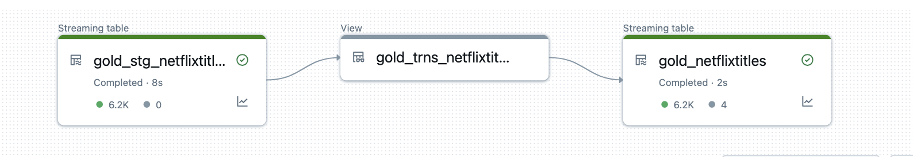
---
---
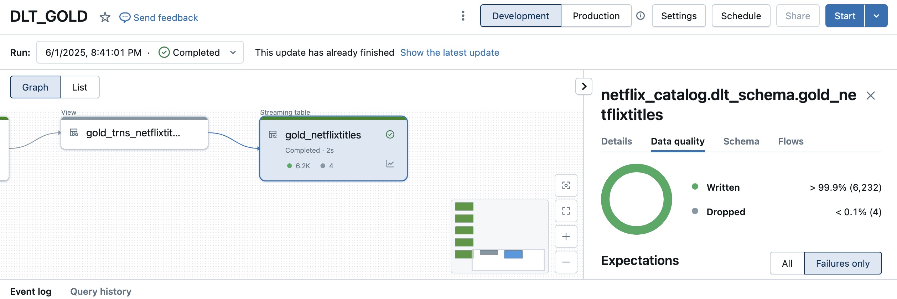

----------

## 7. Unity Catalog & Access Control

-   Created external location and linked catalog
    
-   Configured table-level access via Unity Catalog and RBAC
    

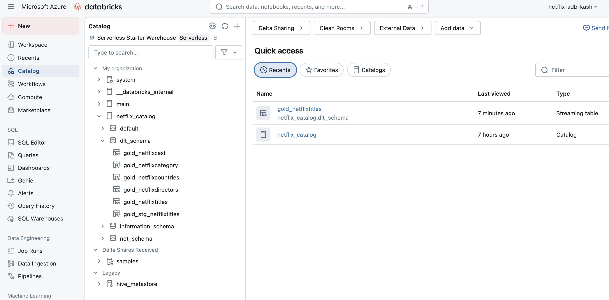

----------

## 8. Optional Integration — Power BI / Synapse

-   Gold tables can be wired to Power BI or Azure Synapse Analytics
    
-   Used for real-time dashboarding and BI analysis

----------

End of Walkthrough 

